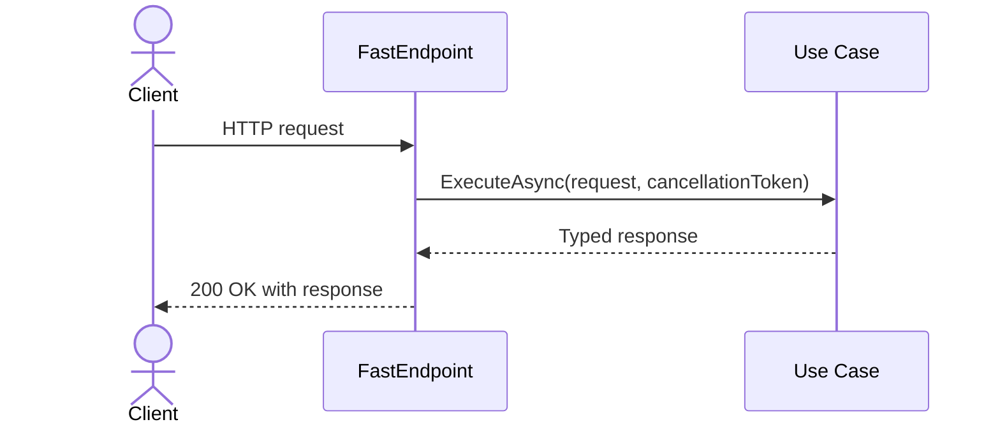

# C# Patterns Repository

This repository is a collection of C# application patterns for Nx workspaces.
Each pattern lives in its own package with documentation, templates, and tests.

## Included patterns

- `usecase-pattern`: an [Nx](https://nx.dev/) generator that creates a C# use
  case and exposes it over HTTP with
  [FastEndpoints](https://fast-endpoints.com/).

## Requirements

- Node.js and npm
- An Nx 23 workspace
- A C# ASP.NET Core project represented in the Nx project graph
- The `FastEndpoints` NuGet package in the target C# project

## Repository setup

Install dependencies, run the tests, and build the distributable generator:

```sh
cd usecase-pattern
npm install
npm test
npm run build
```

The build compiles the TypeScript generator into `usecase-pattern/dist/` and
copies its C# templates alongside the compiled factory.

## Install in an Nx workspace

Install the generator package as a local development dependency after building it:

```sh
npm install --save-dev /absolute/path/to/repository/usecase-pattern
```

The package is private and intended for local or internal workspace use.

## Generate a use case

Run the `usecase` generator with a feature name and target Nx project:

```sh
npx nx generate @local/usecase-pattern:usecase CreateOrder --project=orders-api
```

The default output is:

```text
<project-root>/Features/CreateOrder/CreateOrderUseCase.cs
<project-root>/Features/CreateOrder/CreateOrderEndpoint.cs
```

The generated endpoint uses `POST /api/create-order`. It injects
`CreateOrderUseCase`, passes the request and cancellation token to `ExecuteAsync`,
and sends the typed result as a `200 OK` response.

## Generator options

| Option | Required | Default | Description |
| --- | --- | --- | --- |
| `name` | Yes | None | Use-case name, supplied as the first positional argument. |
| `project` | Yes | None | Nx project that owns the C# source. |
| `namespace` | No | `<Project>.<Directory>.<UseCase>` | Namespace used by both generated classes. |
| `directory` | No | `Features` | Output directory under the project root. |
| `route` | No | `/api/<kebab-case-name>` | Route exposed by the endpoint. |
| `method` | No | `Post` | One of `Delete`, `Get`, `Patch`, `Post`, or `Put`. |

For example:

```sh
npx nx generate @local/usecase-pattern:usecase GetInvoice \
  --project=billing-api \
  --directory=Application/Invoices \
  --namespace=Acme.Billing.Invoices \
  --route='/invoices/{id}' \
  --method=Get
```

## Complete the generated implementation

The generated `ExecuteAsync` method intentionally throws
`NotImplementedException`. Replace it with the feature's application logic and
add fields or validation to the generated request and response records.

Register FastEndpoints and each generated use case in the target application:

```csharp
using FastEndpoints;

var builder = WebApplication.CreateBuilder(args);

builder.Services.AddFastEndpoints();
builder.Services.AddScoped<CreateOrderUseCase>();

var app = builder.Build();

app.UseFastEndpoints();
app.Run();
```

FastEndpoints applies its normal authorization behavior to generated endpoints.
Only add `AllowAnonymous()` in an endpoint's `Configure()` method when the route
is intentionally public.

## Pattern flow



## Repository structure

```text
README.md                                         Repository documentation
usecase-pattern/generators.json                   Nx generator registration
usecase-pattern/mainfest.yaml                     Pattern metadata and documentation
usecase-pattern/scripts/copy-assets.mjs           Template packaging script
usecase-pattern/src/generators/usecase/           Generator source and tests
```

## Development

```sh
cd usecase-pattern
npm test       # Run generator tests with Vitest
npm run build  # Compile TypeScript and package the C# templates
```

The tests run the generator against an in-memory Nx workspace and verify default
and customized output paths, namespaces, routes, and HTTP methods.